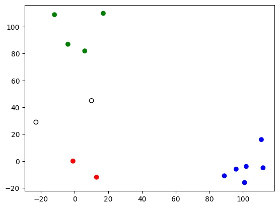

<!-- Check whether the assignment is ready to release -->
{{'now' | date: '%s'}}
{{page.release_date | date: '%s'}}
 
<div class="alert alert-danger">
Warning: this assignment is out of date.  It may still need to be updated for this year's class.  Check with your instructor before you start working on this assignment.
</div>

<!-- End of check whether the assignment is up to date -->


<!-- Check whether the assignment is up to date -->
{{'now' | date: '%Y'}}
{{page.due_date | date: '%Y'}}
 
<div class="alert alert-danger">
Warning: this assignment is out of date.  It may still need to be updated for this year's class.  Check with your instructor before you start working on this assignment.
</div>

<!-- End of check whether the assignment is up to date -->



<div class="alert alert-info">
You can download the materials for this assignment here:
<ul>

<li><a href="{{item.url}}">{{ item.name }}</a></li>

</ul>


<i>Remember to make a copy of the notebook into your own Drive by choosing “Save a Copy in Drive” from Colab’s “File” menu.</i>

</div>



{{page.type}} {{page.number}}: {{page.title}}
=============================================================

_Due: {{page.due_date}}_

## Pre-assignment material

#### Pre-course survey (2 points)

Please fill out this short [survey](https://forms.gle/CHnSTiwY26BAiyUK6).
Your answers will help your instructor get to know you and learn what you hope to get out of this course. This will help me modify the course to best fit your interests.

#### Growth mindset (5 points)
Watch the following 10-minute video about a growth-mindset.

<div style="max-width:854px"><div style="position:relative;height:0;padding-bottom:56.25%"><iframe src="https://embed.ted.com/talks/lang/en/carol_dweck_the_power_of_believing_that_you_can_improve" width="854" height="480" style="position:absolute;left:0;top:0;width:100%;height:100%" frameborder="0" scrolling="no" allowfullscreen></iframe></div></div>

<br><br><br>
Then, in a file called `GROWTH.txt`, define what a 'growth mindset' means to you in your own words. Then, explain how you intend to apply this concept in our class throughout the semester. 
How do you think adopting a growth mindset can benefit your learning and performance in this course?

## Overview

The goal of this assignment is to implement a supervised machine learning algorithm (in this case K-nearest neighbors) and apply it to a real dataset. Along the way you should familiarize yourself with some of the terminology we have been discussing in class. You will also get a chance to practice working with large datasets (and practice Python if it has been a while).

### Provided code
You are provided the following files in `/home/apoliak/Public/ml-course/hws/HW01_starter.zip`:

- `knn.py` - a class called `KNN`. You will be
implementing missing functionality to this class.
- `knn_test.py` - a file to test your implementations.

We also provided you with a `README.md`. You will answer for analysis questions and feedback in this document.

## 1. Look at the data

The data for HW01 is a set of handwritten digits from zip codes written on hand-addressed letters. The dataset is separated into `train`, `dev`,  and `test`.

Read about this dataset by going to the Elements of Statistical Learning website, <a href="http://statweb.stanford.edu/~tibs/ElemStatLearn/">ESL</a>, then clicking on the “Data” tab, then clicking on the “Info” for the zip code dataset. It is similar to the <a href="https://en.wikipedia.org/wiki/MNIST_database">MNIST dataset</a> (examples shown below):


Use the command `less` in the terminal to view the beginning of each file. Both datasets have the same format: the first column is the “label” (here an integer between 0 and 9, inclusive, that corresponds to the identity of a hand-written zip code digit), and the rest of each row is made up of gray-scale values corresponding to the image of this hand-written digit.

## 2. Reading in data

One useful technique is to load a dataset from a file into a numpy array. Here is an example:

```
import numpy as np
train_data = np.loadtxt("path/to/train/file")
```

In the main method of `knn.py`, we load in the dataset already for you:

```
np.loadtxt(os.path.join(args.root_dir, args.train_dataset), delimiter=',')
```

Add this functionality to test this approach by printing 
`train_data`. Make sure the data format makes sense. You can also import the test data in this way. After you load the data, print the shape. The shape of a numpy array represents the dimensions. What is the shape of the training data? Of the testing data?

```
print(train_data.shape)
print(test_data.shape)
``` 

In the main method, split the training data into a matrix that stores the input, i.e. features for each example,
and a vector that stores the labels.
You will pass these two items into the `KNN` class's constructor.

## 3. Distance function
An important part of many machine learning methods is the concept of `distance` between examples. We often phrase this as a `metric` on our inputs. Implement the method called `distance` that takes as input two examples (any two examples)
and outputs the distance (we’ll use Euclidean for now) between them. Although there are many built-in functions the perform this task, please implement your distance function from scratch. However, you are welcome to use numpy functions as part of it (for example, you may use np.sum and similar functions, but look up how they work first).

## 4. Classification
Create a function that takes as input one test example and an integer k, and outputs a prediction based on a nearest-neighbor classifier. This function will loop through all the training examples, find the distance between each one and the input test example, and then find the K nearest neighbors (you are welcome to use numpy sorting methods, but look up how they work first). For this subroutine, you will need to use the `distance` function.

### 5. Quantify the accuracy
Implement a method called `accuracy` that computes the fraction or percentage of correctly predicted examples.

### 6. Putting it all together
In your main method, loop through all the filtered test examples, using your classification function to predict the label for each one. Also create a way of determining if the prediction was correct or not, based on the labels of the test data. Compute the fraction or percentage of correctly predicted examples. How does this change as K varies? Try K 1-10 (at least) and record the accuracy.

### 7. Test Predictions

You should notice that the examples in `test.csv` are unlabeled since the first column is a vector of `-1`. Once you determine the best hyper-parameter value, apply the KNN algorithm to the examples in `test.csv`.
Store the predictions in a new file called `preds_test` where each line contains the prediction for the corresponding example. `preds_test` should have 1000 rows.

***Note:*** You can train KNN on just `train.csv`, `dev.csv`, or both. The choice is up to you.

### Output
When I run your program on the command line as shown below:

`python3 knn.py`

You should output something like this (round accuracy to 3 decimal places):
```
Nearest Neighbors:
K=1, xx.xxx%
K=2, xx.xxx%
...
K=10, xx.xxx%
```

## Testing
We have provided unit tests to test your implementations.
Run the provided unit tests provided in [tests.py]().
Initially, many of them will fail. 
If your program is working correctly, all of them will pass. However, the converse is not true: passing all the tests is not sufficient to demonstrate that your code is working. 
*Using tests.py is strongly encouraged, this is similar to how your code will be graded on gradescope.*

The unit tests are based on small toy examples.The toy examples contain 12 training instances (labeled green, red, or blue)
and 2 test instances. Each instance contains just two features (x,y coordinates). 
This figure shows the toy example:



## Analysis Questions and submitting your work
Make sure to fill out the README.md with answers to all the analysis questions! 

Credit: based on Exercise 2.8 from “The Elements of Statistical Learning”


### Submitting

Submit the following files to the assignment called `HW01` on Gradescope:

1. `knn.py`
2. `preds_test`
3. `README.md` 

Make sure to name these files exactly what we specify here. Otherwise,
our autograders might not work and we might have to take points off.

## Extensions (optional, but recommended!)
If you do any of the extensions, document this in your `README.md` (especially if you included additional command line arguments). I occasionally demo excellent extensions in class.

- If you are familiar with confusion matrices, create one for this test dataset and your “best” value of K.

- Create a plot of accuracy vs. K.

- Visualize some of the examples that were classified incorrectly. The examples are 16x16 gray-scale images, so you can plot them on a grid.

- Create command line arguments for which digits to include. Or you could let the user decide how much training data to use, what K value to use, or how many classes to use.

- Replace all for loops in your code with vector operations. Python for loops are very slow, using vector operations
is typically must faster. We will see this through out the course.
