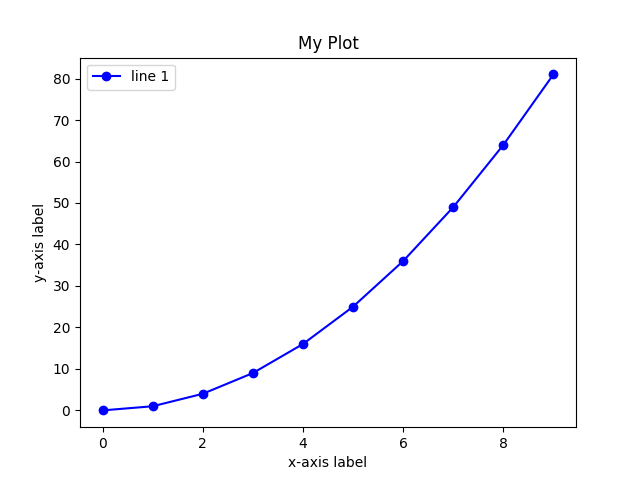

<!-- Check whether the assignment is ready to release -->
{{'now' | date: '%s'}}
{{page.release_date | date: '%s'}}
 
<div class="alert alert-danger">
Warning: this assignment is out of date.  It may still need to be updated for this year's class.  Check with your instructor before you start working on this assignment.
</div>

<!-- End of check whether the assignment is up to date -->


<!-- Check whether the assignment is up to date -->
{{'now' | date: '%Y'}}
{{page.due_date | date: '%Y'}}
 
<div class="alert alert-danger">
Warning: this assignment is out of date.  It may still need to be updated for this year's class.  Check with your instructor before you start working on this assignment.
</div>

<!-- End of check whether the assignment is up to date -->



<div class="alert alert-info">
You can download the materials for this assignment here:
<ul>

<li><a href="{{item.url}}">{{ item.name }}</a></li>

</ul>


<i>Remember to make a copy of the notebook into your own Drive by choosing “Save a Copy in Drive” from Colab’s “File” menu.</i>

</div>



{{page.type}} {{page.number}}: {{page.title}}
=============================================================

_Due: {{page.due_date}}_

## Overview

The goals of this week’s assignment are:

- Implement a decision-tree algorithm
- Practice working with classes in the context of ML
- Implement schemes to prevent overfitting
- Perform experimental analysis on your decision tree

The main datasets we will be investigating are the heart disease and diabetes datasets (more info at the end of the assignment).
This assignment is to be done individually. Discussing high-level ideas with others in the class is encouraged, but you should not be sharing code in any way.

### Provided Code

- `data` - directory containing train/test datasets including tennis and movies for testing your algorithm (note that in both these cases the train and test datasets are the same for simplicity, although this is not realistic in general). 
- `run_dtree.py` - your main program executable
- `DecisionTree.py` - a class file to define your decision tree data structure
- `util.py` - file parsing and featurization helper functions
- `Partition.py` - a class file to define your partition data structure
- `README.md` - for analysis questions and homework feedback

## Implement a Decision Tree

You will implement an ID3-like decision tree in this part of the homework. A few steps have been provided in the starter code. First investigate these steps and make sure the code is clear to you:

- Read in ARFF formatted train and test set files
- Convert continuous features into thresholded binary features

The next steps you will implement:

- Build trees to a maximum depth as determined by user input
- Output the learned tree as a human-interpretable model
- Evaluate the constructed tree on a held-aside test set

### Usage

Your program should take in 2-3 command-line arguments:

1. Path to the training dataset `-r`
2. Path to the testing dataset `-e`
3. (optional) Maximum depth of the tree `-d` (if none, unlimited depth)

For example, the following command will train a decision tree of max depth of 1
on the movies dataset and test it on the movies dataset:
``` unix
python run_dtree.py -r input/movies_train.arff -e input/movies_test.arff -d 1
```

Investigate the function `parse_args` in `util.py,` where the arguments are parsed. 
This function makes use of the `argarse` library, 
which we will be using through out the semester to manage command-line arguments.

### Program Style Requirements
- Your program should follow good design practices - effective top-down design, modularity, commenting for functions (triple quotes) and code (hashtags), etc.

- You should break your program up into multiple files with `run_dtree.py` as the main executable (you shouldn’t end up with a lot of code in `run_dtree.py`). You should build classes in separate files (`Partition.py` holds datasets, and `DecisionTree.py` holds the tree structure, but you could include others).

- All decision tree algorithm details should be encapsulated in your decision tree class. The main file should only directly handle data parsing and the main control flow for calling decision tree steps (e.g., train, test, output).

- Clean up any debugging print statements at final submission. It may be useful to use these during development, but need to be cleaned up before we grade them.

- All functions should include a top-level comment (triple quotes) describing purpose, parameters, and return values.

- Avoid using existing libraries to solve major components of the program. You are more than welcome to use numpy for array management. Please ask me if there are other libraries you are interested in using.

### Program Inputs
- Your program is expected to read files that are in the ARFF format.

- The header of the file describes the features and class label. You can assume that the class label is the last line in the feature list and will be named class to easily demarcate the end of the header. You can also assume the headers in the train and test files are the same.

- Subsequent lines after the header contain one example per line represented as commas separated feature values. The feature values occur in the same ordering as feature descriptions in the header (with the class label being at the end of the line).

- Your program should handle both discrete and continuous features. You can assume the class label is discrete (and binary).

- Lines starting with % are comments and should be ignored.

- I have provided data sets for testing purposes in the input directory including a heart disease prediction task (heart_{train,test}.arff) and a diabetes prediction task (diabetes_{train,test}.arff). You are encouraged to add your own toy examples for the purposes of debugging. Be sure to follow the format required in the usage.

- The other type of input is the optional maximum depth of the tree. This should be a non-negative integer - all other values should be rejected and lead to a clean exit with error message. If no value is given, trees may have unlimited depth but should obey other stopping conditions.

### Program Main Behavior
Your program should process inputs, parse and index training and test examples, and induce a decision tree. There are very few restrictions on how you do this, but be sure your tree fits the behavior from class:

- Never use information from the test set in any part of learning the tree, including when you decide thresholds for continuous features.

- You may assume that the prediction task is binary, with the first value as `-1 (negative)` and the second value as `+1 (positive)`. You can implement multi-valued prediction as an extension.

- Continuous features are converted into multiple binary features using thresholding at class label changes (provided in `util.py`). The feature name uses the less than or equal to relation (i.e., the feature value is `True` if it is <= to the threshold). We will choose the mid-point between two adjacent feature values. e.g., if there is a label change from `X=20` and `X=30`, we will add a feature `X<=25`.

- There should be a branch for each value of a chosen feature. This is described in the header of the arff file, and is limited to `True` and `False` for the converted continuous features. It is probably simplest to store these as string type.

- Use information gain for your selection criteria. Among features with the same information gain, choose the feature that comes first in the ordered dictionary. Here are the information gains for the tennis and movies datasets (at the root). A good first step might be to implement your entropy functions (inside `Partition.py`) and check your answers here!

#### TENNIS
```
Info Gain:
     Outlook, 0.246750
 Temperature, 0.029223
    Humidity, 0.151836
        Wind, 0.048127
```

#### MOVIES
```
Info Gain:
         Type, 0.306099
       Length, 0.306099
     Director, 0.557728
Famous_actors, 0.072780
```

- The stopping criteria for a leaf is:

	- All examples in the partition have the same label.
	- There are no features remaining to split on.
	- The maximum depth has been reached.
	- There are no examples in the partition.
	- The labels at leaves should be the majority label of the examples at the leaf (in other words, we will not use probabilities for predictions). Ties should be broken in favor of the negative.

#### Unit tests
`tests.py` contains unit tests that you should use to compute your entropy functions.
You should include helper methods in `Parition.py` for computing entropy. Some of these (not all) help methods
are listed in `tests.py`.

### Program output
When run, your program should print out the following:

- A formatted decision tree to visualize the learned model. See example outputs below for formatting help. In general, you will print the tree in pre-order traversal (print the current node, then recurse on each child) with each node having one line of output for each branching child. The line should be tabbed based on the current depth, then include the name of the feature/feature-value pair, and the distribution of class labels for examples that reached that node. If you have reached a leaf, also add the label that would be returned.

For example, here is the result of the tennis dataset from Handout 3 (sort the child branch labels so that your ordering is consistent). At the root, there are 9 days tennis is played and 5 days it is not.

- Print the overall accuracy on the test set.
Here are a few examples:

#### TENNIS, no max depth

```
$ python run_dtree.py -r input/tennis_train.arff -e input/tennis_test.arff
[5, 9]
Outlook=Overcast [0, 4]: 1
Outlook=Rain [2, 3]
|   Wind=Strong [2, 0]: -1
|   Wind=Weak [0, 3]: 1
Outlook=Sunny [3, 2]
|   Humidity=High [3, 0]: -1
|   Humidity=Normal [0, 2]: 1

14 out of 14 correct
accuracy = 1.0000
```

#### TENNIS, max depth = 1

```
$ python run_dtree.py -r input/tennis_train.arff -e input/tennis_test.arff -d 1
[5, 9]
Outlook=Overcast [0, 4]: 1
Outlook=Rain [2, 3]: 1
Outlook=Sunny [3, 2]: -1

10 out of 14 correct
accuracy = 0.7143
```
#### MOVIES, no max depth

```
$ python run_dtree.py -r input/movies_train.arff -e input/movies_test.arff
[3, 6]
Director=Adamson [0, 3]: 1
Director=Lasseter [3, 1]
|   Type=Animated [2, 0]: -1
|   Type=Comedy [1, 0]: -1
|   Type=Drama [0, 1]: 1
Director=Singer [0, 2]: 1

9 out of 9 correct
accuracy = 1.0000
```

#### MOVIES, max depth = 1

```
$ python run_dtree.py -r input/movies_train.arff -e input/movies_test.arff -d 1
[3, 6]
Director=Adamson [0, 3]: 1
Director=Lasseter [3, 1]: -1
Director=Singer [0, 2]: 1

8 out of 9 correct
accuracy = 0.8889
```

### Implementation suggestions
- Implement entropy and information gain in the `Partition.py` class. Work slowly to build up the functions that will be necessary to compute information gain (you may need several).

- Think about what the `DecisionTree constructor` should take as arguments. One suggestion is to do the entire ID3 algorithm within the `DecisionTree` constructor (implicitly returning the root node).

- Your algorithm should be recursive! Make sure you are making an instance of the Partition class when you divide the data based on feature values. Then call your tree-building function on this partition.

- You can have a `Node` class and distinguish between internal nodes and leaves. This is not a requirement. Another option is to have a node name attribute: for internal nodes this is the feature name and for leaf nodes this is the label of the majority class.

- Notice that in the starter code, the training data features are converted from continuous to binary, but the testing data features are not. This is deliberate. (why?) When you classify test examples, think about how to make their feature values work with the decision tree you have created using the training data.

## Analysis

### Hyperparameter Tuning
Run experiments at various depth levels including, at a minimum, depths of 1, 2, 4, 7, and 10. What happens to the training set accuracy and test set accuracy as the depth varies? Is this what you expected? Discuss your observations in your README.md.

### Plotting

Generate two learning curve graphs (i.e., line graphs) with an accompanying analysis of the graphs. On the x-axis, show the depth of a tree. On the y-axis, show the accuracy of the tree on both the training set and test set. You should have one graph for the diabetes data set and one graph for the heart disease data set. Describe what you can conclude from each graph. Be sure that your graphs are of scientific quality - including captions, axis labels, distinguishable curves, and legible font sizes.

Here is an example of creating a plot using matplotlib, but you are welcome to use a different program for this part.

``` python
# import plotting library
import matplotlib.pyplot as plt

# set up sequences of x and y values (make sure they are of the same length)
x = range(10)
y = [val**2 for val in x]

# plot the (x,y) values (considered as pairs), using blue (b) circles (o),
# connected by lines (-)
plt.plot(x,y,'bo-')

# title, axis labels, and legend
plt.title("My Plot")
plt.xlabel("x-axis label")
plt.ylabel("y-axis label")
plt.legend(["line 1"])

# I usually use "show" at first to see the plot, then save it later
plt.show()
#plt.savefig("my_plot.png", format='png')
```



## Extensions (Optional)

#### Multi-class prediction
Both data sets I have provided have two class labels. Decision trees easily extend to multi-class prediction. Find a relevant data set (e.g., at Kaggle or the UC Irvine Machine Learning Repository) and evaluate your algorithm with multiple discrete values allowed for labels.

#### Min Leaf Size
Another approach to prevent overfitting is setting a minimum number of examples in a leaf. If a split causes results in children below the threshold, the recursion is stopped at the current node and a leaf is created with the plurality label. This is often more flexible than maximum depth - it allows variable depth branches while still trying to prevent overly detailed hypotheses that only fit to a few examples. Add minimum leaf size as an optional command line argument.

#### Learning curves for training set size
Machine learning algorithms are often sensitive to the amount of training data - some algorithms thrive when there is large amounts of data but struggle when data is sparse (e.g., deep neural networks) while others plateau in performance even if more data is available. Evaluate your decision tree on the given training data by randomly subsampling the data to create smaller training sets e.g., use 10% of training data. Choose at least 5 training set sizes and plot them on the x-axis with the y-axis describing the accuracy. You’ll probably want to run each training set size 3-5 times and average the results. Describe what you see when you compare training and test accuracy as the training set grows.

## FAQ

**How do I know if my code is working?**  
Run the provided unit tests provided in [`tests.py`]().
Initially, many of them will fail. 
If your program is working correctly, all of them will pass. However, the converse is not true: passing all the tests is not sufficient to demonstrate that your code is working. 
*Using `tests.py` is strongly encouraged, this is similar to how your code will be graded on gradescope.*

## README.md

In a text file called `README.md` answer the following questions:

1. How much time did you spend on the homework
1. What did you learn from this homework
1. optional: What did you struggle with during this homework
1. optional: any other feedback you would like to share

## Submitting

Submit the following files to the assignment called `HW02` on Gradescope:

README.md 
1. `run_dtree.py`
2. `Parition.py`
3. `DecisionTree.py`
2. `README.md` 

Make sure to name these files exactly what we specify here. Otherwise,
our autograders might not work and we might have to take points off.
Add any other files that you created that are needed for your code to run.

## Acknowledgements
Modified from lab by: Sara Mathieson, Ameet Soni.

Both data sets were made available by the UC Irvine Machine Learning Repository. The heart disease data set is the result of a study by the Cleveland Clinic to study coronary heart disease. The patients were identified as having or not having heart disease and the resulting feature set is a subset of the original 76 factors that were studied. The diabetes data set is the result of a study of females at least 21 years old of Pima Indian heritage to understand risk factors of diabetes. Both data sets were converted to ARFF format by Mark Craven at the University of Wisconsin.
